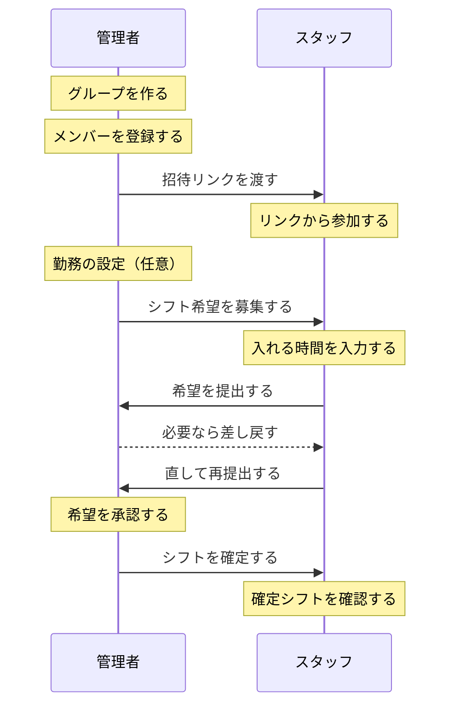
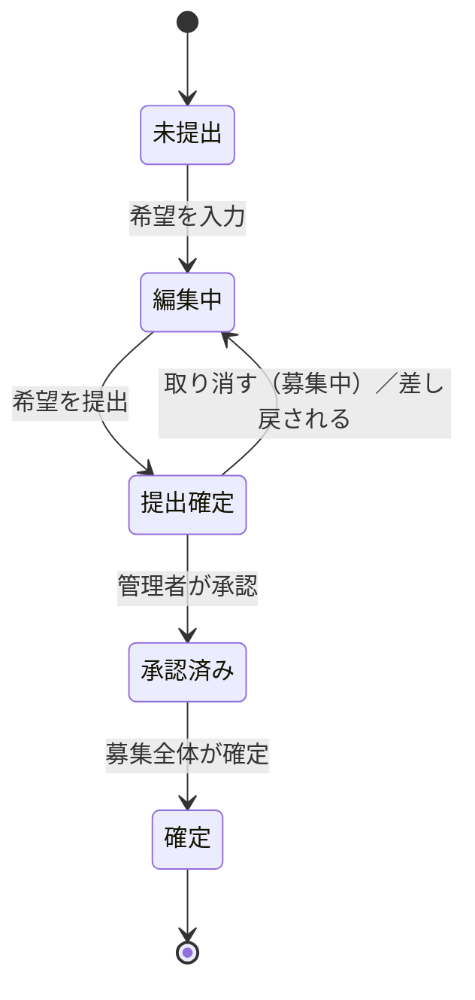
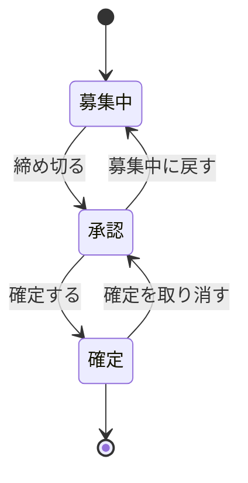

<!-- 自動生成: soroe/docs/user-guide.md から取り込んだもの。直接編集せず、原稿を直して `npm run sync:guide` を実行すること。 -->

シフトの予定を合わせるためのアプリ **soroe** の使い方。
スタッフが「入れる時間」を提出し、管理者がそれを見ながらシフトを組んで確定・共有する。

> **図はすべてラフ画**（画面の構造を説明するための図）。実機の配色・余白・書体とは異なる。
> 図に出てくる店名・氏名・日付はサンプル値。
> アプリ内の使い方ガイド（設定 → 使い方ガイド）と同じ内容を、画面図つきで詳しくしたもの。
> 図は 2026-08-08 に Flutter Web（モバイル幅 375×812）の実機と突き合わせ済み。

## 用語

| 用語 | 意味 |
|---|---|
| グループ | 職場・店舗・チームの単位。作った人が**オーナー（管理者）**になる。 |
| メンバー（名簿） | グループに属する1人分の枠。まずは管理者が枠を作り、招待リンクで本人のアカウントと連携する。 |
| 招待リンク | メンバー枠1つにつき1本発行されるリンク。**1枠＝1人**で、使い回さない。 |
| 勤務帯 | 「早番 08:00〜13:00」のような時間帯の定義。スタッフはここから選んで希望を出せる。 |
| 雇用形態 | アルバイト・正社員など。形態ごとに使える勤務帯と曜日の初期値を決められる。 |
| 募集（期間） | 「7月前半（7/1〜7/15）」のように、希望を集める1つの期間。最大31日、期間の重複は不可。 |
| 希望（入れる時間） | スタッフが各日について出す「働ける時間」または「休み」。 |
| 提出確定 | スタッフが希望を出し切ってロックすること。以後は本人も編集できない。 |
| 承認 | 管理者がその人の提出を受理すること。直してほしいときは**差し戻し**。 |
| 確定 | 募集全体を締めてシフトを確定すること。確定後はスタッフが確定シフトを見られる。 |

## 全体の流れ

## カレンダーと表の見かた

シフトが載る場所は2つ。**グループトップの月カレンダー**（自分の予定）と、
**募集ごとの「みんなの希望・確定」**（全員 × 日付の表）。どちらも同じ色の決まりで描かれる。

| No. | 場所 | 説明 |
|---|---|---|
| 1 | 月の切り替え | `‹` `›` で前後の月へ。「今日」で今月に戻る。 |
| 2 | バー ／ 数値 | バー＝勤務時間を帯で表示。数値＝出勤・退勤を数字で表示。 |
| 3 | 日付のマス | 1マス＝1日。日付の下に勤務帯のバーと勤務帯名が入る。タップするとその日の募集（みんなの希望・確定）へ移動し、募集が無い日はその場で詳細だけ出る。 |
| 4 | 凡例 | 色と塗りの意味。 |
| 5 | 週 ／ 1列 | 週＝1週間ずつ折り返して縦に積む（既定）。1列＝図のように全期間を横に並べる。メンバーが6人以上だと自動で1列。 |
| 6 | 表のセル | 縦がメンバー、横が日付。セル1つがその人のその日。日付をタップするとその日の全員分が出る。管理者はセルをタップして担当を確定する。 |

**色の決まり**

| 見た目 | 意味 |
|---|---|
| 塗りつぶし | 確定したシフト |
| 斜線 | 希望（仮）。まだ確定していない |
| 紫の塗り | 休み |
| セル右上の印 | 出した希望と違う内容で確定された |
| 青い枠＋薄い塗り | いま編集しているマス |
| 背景色が変わったマス | まだ保存していない変更 |
| 薄い黄緑の枠の列 | 今日 |

> 図では色を再現していないため、セルを勤務帯名（早番・遅番・休）の文字で示している。

---

# 管理者編

## 1. グループ（職場）を作る

グループ一覧の役割別カード（または一覧末尾の「グループを追加」）から作成する。
**作成した人がそのグループの管理者（オーナー）**になる。

| No. | 場所 | 説明 |
|---|---|---|
| 1 | 「グループをつくる」カード | はじめての人には役割別の2枚が出る。管理者は左をタップ。 |
| 2 | 「リンクで参加する」カード | 招待された人は右。招待リンクやキーを貼り付けて参加する。 |
| 3 | グループ名 | 店舗名・チーム名を入れる。あとからいつでも変更できる。 |
| 4 | 「つくる」ボタン | グループ名を1文字以上入力すると押せる。押すとグループトップへ。 |
| 5 | はじめてガイド | 管理者だけに出る初期セットアップの順路。各行から該当画面へ飛べる。必須ステップが終わるか、閉じると出なくなる。 |
| 6 | 「シフト希望」ボタン | 募集の一覧。未確定の件数がバッジで出る。 |

## 2. メンバーを登録して招待リンクを渡す

先に名簿の枠を作り、その枠ごとの招待リンクを本人に渡す。
スタッフがリンクを開くと、その枠と本人のアカウントが連携される。

| No. | 場所 | 説明 |
|---|---|---|
| 1 | 「メンバー追加」 | 名簿に1人ずつ枠を作る。この時点ではまだアカウントとは結びついていない。名前を入れると「追加」が押せる。 |
| 2 | 各行の共有アイコン | その人の招待リンク（QR・コピー・共有）を開く。管理者の行には出ない（代わりに「管理者」チップ）。行タップはメンバー詳細。 |
| 3 | 自由入力を許可 | ONで開始・終了時刻を自由に指定できる。OFFは使用可能な勤務帯からの選択だけ。 |
| 4 | 管理者にする | オーナー同等の権限。連携（招待リンクでの参加）後に有効になる。 |
| 5 | 共有 | LINE・メールなどで本人に渡す。**1枠＝1人**なので使い回さない。 |

**注意**

- 招待リンクを他の人に渡すと、その人がその枠として参加してしまう。
- 枠を間違えた／端末を替えたときは、メンバー詳細の「リンク解除（招待リンク再発行）」で作り直す（→ [メンバーの設定と状態を変える](#メンバーの設定と状態を変える)）。
- 「みんなの希望を見せる」をOFFにすると、その人には他メンバーの希望・確定が表示されない。

### メンバーの設定と状態を変える

名簿の行をタップするとメンバー詳細が開く。ここで許可・権限・連携を変え、退職や付け替えにも対応する。

| No. | 場所 | 説明 |
|---|---|---|
| 1 | メンバーID | 社員番号など。帳票に出る（空でもよい）。 |
| 2 | 自由入力を許可 | ONで開始・終了時刻を自由に指定できる。OFFは使用可能な勤務帯からの選択だけ。 |
| 3 | みんなの希望を見せる | OFFにすると、その人には他メンバーの希望・確定が表示されない。管理者は常に見られる。 |
| 4 | 保存 | 画面下に常時出る。変更したまま戻ろうとすると破棄の確認が出る。 |
| 5 | 管理者にする | オーナー同等の権限。連携（招待リンクでの参加）後に有効。 |
| 6 | リンク解除（招待リンク再発行） | 枠と相手の結び付きを切り、新しい招待リンクを発行する。**端末を替えた・別の人に渡し直すときはこれ**。 |
| 7 | メンバーの状態 | 無効化＝募集の対象外にする（あとで有効化できる。招待リンクは再発行）。削除は元に戻せない。管理者のメンバーには出ない。 |

## 3. 勤務の設定をする（任意）

この手順は**任意**。設定しなくても募集・提出はできる（そのぶん入力は自由入力か休みだけになる）。
「早番」「遅番」などを登録しておくと、スタッフの希望入力が選ぶだけで済む。

| No. | 場所 | 説明 |
|---|---|---|
| 1 | 勤務帯を追加 | 「早番 08:00〜13:00」のような時間帯を登録する。日をまたぐ勤務にも対応。 |
| 2 | 使用できる勤務帯 | 未選択なら全勤務帯が使える。選ぶと、その雇用形態の人はそこからだけ選べる。 |
| 3 | 曜日ごとのデフォルト | スタッフが希望を入力するとき、最初から入った状態になる初期値。 |

## 4. シフト希望を募集する

対象期間と提出締切を決めて募集を1つ作る。作った直後は「募集中」で、スタッフが希望を出せる。

| No. | 場所 | 説明 |
|---|---|---|
| 1 | 「新規募集作成」カード | 対応が必要な募集がないときに出る（あるときは「やること」カードに替わる）。 |
| 2 | 「シフト希望」ボタン | 既存の募集を開くときはここ。一覧の先頭にも「新規希望」の追加枠がある。 |
| 3 | 開始日・終了日 | タップするとカレンダーが開く。終了日は開始日以降＋最大31日しか選べない。同じグループ内で日付が重なる募集は作れない。 |
| 4 | 提出締切 | 任意。過ぎるとワークフローカードが「締切超過」になり、締め切りを促す。 |
| 5 | 「作成」ボタン | 開始日と終了日が決まり、期間の検査を通ったときだけ押せる。作成するとそのまま「みんなの希望・確定」へ移動する。 |
| 6 | ワークフローカード | いまの段階（募集中／承認中／確定済）と、次にできる操作。 |

### 作った募集を開く・直す

AppBar の「シフト希望」ボタンから募集の一覧が出る。募集を選ぶとメニューが開き、そこから作業画面へ移る。

| No. | 場所 | 説明 |
|---|---|---|
| 1 | 未確定 ／ すべて | 既定は「未確定」（募集中・承認中）。未確定が1件も無いときは「すべて」で開く。 |
| 2 | 新規希望 | 管理者だけに出る。新しい募集を作る。 |
| 3 | 募集カード | 状態・期間・締切と、自分のやること（管理者＝承認待ち件数／スタッフ＝自分の提出状態）が出る。対応が必要なカードは枠がオレンジになる。 |
| 4 | 段階の表示 | 管理者は3段階（希望を集める／承認／確定）、スタッフは4段階（希望を入力／希望を提出／承認／確定）。 |
| 5 | 自分の希望 ／ みんなの希望 | やることがある側はオレンジで強調。「みんなの希望」は許可されたメンバーだけ出る。 |
| 6 | 募集期間 | **作成後は変更できない**（出された希望と日付が食い違うため）。直したいときは作り直す。 |
| 7 | この募集を削除 | その募集の希望・確定もすべて消える。元に戻せない。 |

## 5-6. 希望を締めて承認し、シフトを確定する

締切がきたら募集を締め、提出された希望を1人ずつ承認する。
割り当てが決まったら募集を確定する。

| No. | 場所 | 説明 |
|---|---|---|
| 1 | 「提出状況」ボタン | 承認待ちの件数がバッジで出る。広い画面では右に常設パネルとして出る。 |
| 2 | ワークフローカード | 締切を過ぎるとオレンジになり「締め切りましょう」と促す。 |
| 3 | 承認 / 差し戻し | 提出確定した人だけ承認できる。承認・差し戻しは**確定前ならいつでも**行える。 |
| 4 | 未提出の行 | 未提出・編集中の人には操作ボタンが出ない。 |
| 5 | 「確定する」 | 確定するとスタッフが確定シフトを見られる。以後は編集できない。 |
| 6 | 「募集中に戻す」 | 締めたあとでも募集中に戻せる。確定後は「確定を取り消す」で承認フェーズへ戻る。 |

**各日の担当を決める**

「みんなの希望・確定」の表でセルをタップすると、その日その人の担当を確定できる
（→ [1日ずつ順番に確定する](#1日ずつ順番に確定する)、[カレンダーと表の見かた](#カレンダーと表の見かた)）。

### 1日ずつ順番に確定する

表のセルをタップすると、下に確定パネルが開く。スタッフ側の希望入力と同じ操作感で、
「確定して次へ」を押すと**その人の翌日へ**進む。

| No. | 場所 | 説明 |
|---|---|---|
| 1 | 編集中のマス | **青い枠＋薄い塗り**で強調される（「編集中」といった文字は出ない）。紫は確定したが**まだ保存していない**マス。 |
| 2 | 対象 | タップしたセルの人と日。「7/3（3 / 15）」＝期間の3日目。 |
| 3 | 希望 | その人がその日に出した希望。これを見ながら担当を決める。 |
| 4 | 選択肢 | 勤務帯・自由入力・休みのほかに「確定なし」（すでに付けた確定を外して未確定に戻す）。自由入力は対象者の設定に関わらず管理者は使える。 |
| 5 | 確定して次へ | いまの選択で確定して次の日へ。最終日では「確定して完了」。 |
| 6 | 希望と異なる上書き | 選んだ内容が本人の希望と食い違うと出る。**止めはしない**が、表では右上に印が付いて後から見分けられる。 |
| 7 | すべての日を確認しました | 最終日まで確定すると出る。**ここではまだ保存されていない。** 閉じてから「保存」を押す。 |

### 日別の詳細と帳票出力

カレンダーや表をタップした先と、シフト表の出力。

| No. | 場所 | 説明 |
|---|---|---|
| 1 | その日の全員 | 日付をタップすると出る。その日に希望を出した人が名簿順に並ぶ。前の日から続く夜勤も出る。 |
| 2 | その人のその日 | セルをタップすると出る。確定があれば「確定：…」、なければ「希望：…」、どちらも無ければ「記録なし」。 |
| 3 | 時間帯のバー | 塗り＝確定／斜線＝希望(仮)／紫＝休み。 |
| 4 | 出力の形式 | いまは「シフト表（Excel）」のみ（スタッフ×日の出退表。確定＝黒／希望(仮)＝グレー）。全員分を見られない人は自分の記録だけが出力される。 |

---

# スタッフ編

## 1. 招待リンクから参加する

管理者から届いた招待リンクを開くだけで、自動でそのグループに参加する。

| No. | 場所 | 説明 |
|---|---|---|
| 1 | 参加処理 | アカウントが無くてもゲストとして参加できる。成功するとそのグループへ入る。 |
| 2 | 「やること」カード | 未提出・差し戻しがあるとオレンジ。選ぶとその画面へ移動する。 |
| 3 | 「シフト希望」ボタン | 募集の一覧。自分の提出状態も各カードに出る。 |
| 4 | やることの項目 | 希望の提出が必要な募集がここに並ぶ。 |

**注意**

- 招待リンクは自分専用（1枠＝1人）。他の人と共有しない。
- 「招待リンクが無効です」「別のアカウントが使用中です」と出たら、管理者にリンクの再発行を依頼する。
- ゲストのままでも使えるが、アカウントを作ると他の端末でも同じグループを使える。

## 2-3. 入れる時間を入力して提出する

募集ごとに、各日の「入れる時間」を登録して提出する。

| No. | 場所 | 説明 |
|---|---|---|
| 1 | カレンダー | 日をタップすると下に入力パネルが開く。「タップで連続入力」がONなら、入力するたび次の日へ進む（→ [1日ずつ順番に入力する](#1日ずつ順番に入力する)）。 |
| 2 | 曜日でまとめて入力 | 曜日ごとに決めて期間全体へまとめて反映する。毎回同じ曜日で働く人はこれが速い。 |
| 3 | 「希望を提出」カード | 希望を1件以上入力すると押せる。提出すると編集がロックされる。 |
| 4 | 自由時間 | 「自由入力を許可」されたメンバーだけ選べる。許可がなければ勤務帯と休みだけ。勤務帯が1つも登録されていないと、シートの上に「使用できる勤務帯がありません」と出る。 |
| 5 | まとめて反映 | 未指定の曜日はそのまま（既存の入力を消さない）。選んだ内容は次回も記憶される。 |
| 6 | 「提出を取り消す」 | 募集中のあいだだけ出る。締切前なら自分で取り消して直せる。 |
| 7 | 状況ラベル | 差し戻されると「修正して、もう一度『希望を提出』してください。」に変わり、再編集できる。 |

### 1日ずつ順番に入力する

カレンダーの日をタップすると、画面の下に入力パネルが開く。
「タップで連続入力」がONなら、勤務帯を選ぶたびに**自動で次の日へ進む**ので、期間を頭から埋めていける。

| No. | 場所 | 説明 |
|---|---|---|
| 1 | 編集中のマス | **青い枠＋薄い塗り**で強調される。中身は通常どおりで、未入力なら「—」のまま（「編集中」といった文字は出ない）。 |
| 2 | 編集中の日 | 「編集中: 7/3（3 / 15）」＝期間の3日目。「タップで連続入力」がOFFのときは「（3 / 15）」が出ず、タップした日だけの修正になる。 |
| 3 | 勤務帯のボタン | 使える勤務帯・休み・（許可されていれば）自由時間。タップするとその日に登録され、次の日へ進む。 |
| 4 | 前の日 ／ 次の日 ／ 保存 | 左の2つは入力せずに日を送る（連続入力がOFFのときは出ない）。「保存」はいつでも押せる。 |
| 5 | キャンセル | 編集をやめる。入力途中のものがあると「破棄しますか?」の確認が出る。 |
| 6 | 表への反映 | 登録した日はその場で表に出る。**まだ保存前**の変更は紫の塗りになる（枠は付かない）。「現在:」はその日にすでに入っている内容。 |
| 7 | すべての日を確認しました | 最終日まで送ると出る。勤務帯の選択肢は消え、保存だけが残る。 |
| 8 | 保存 | **押すまで反映されない。** 触っていない日は元のまま、触った日だけ書き換わる。 |

> 編集中は上の「希望を提出」カードが隠れ、編集中のマスが画面内へ自動でスクロールされる。
> 使える勤務帯が1つも無いときは「休み」か「次の日」だけで進む。

**差し戻されたら**

管理者が差し戻すと、締切後（承認フェーズ）でも自分の希望だけ再編集できる。
直したら、もう一度「希望を提出」を押す。

## 4. 確定したシフトを確認する

管理者が募集を確定すると、自分の確定シフトをカレンダーで確認できる。

| No. | 場所 | 説明 |
|---|---|---|
| 1 | 月カレンダー | 自分の確定シフトが濃く、まだ希望のままのものは薄く出る。日をタップで詳細（→ [カレンダーと表の見かた](#カレンダーと表の見かた)）。 |
| 2 | みんなの希望・確定 | 管理者が「みんなの希望を見せる」をONにした人だけ全員分を見られる。OFFなら自分の行だけ。 |
| 3 | 帳票出力 | シフト表などを出力する。全員分を見られない人は自分の分だけ出力される。 |

---

# 共通

## アカウントとデータの引き継ぎ

アカウントを作らなくても（ゲストのまま）使えるが、**その端末だけ**のデータになる。
アカウントを作ると他の端末でも同じグループを開ける。

| No. | 場所 | 説明 |
|---|---|---|
| 1 | 新規作成 | ゲストで作ったグループがあると、先に引き継ぎの確認が出る。 |
| 2 | 外部アカウントでログイン | LINE・Apple でログインするとパスワード不要。あとから連携もできる。 |
| 3 | 引き継がずに続ける | ゲストのデータを捨ててよいと確認するためのスイッチ。 |
| 4 | このまま続ける | 3をONにしないと押せない。押すとゲストのグループは引き継がれない。**引き継ぎたいときは「新規作成」から**。 |
| 5 | アカウント連携 | 連携すると、他の端末でも同じアカウントでログインできる。 |
| 6 | 既存アカウントに引き継ぐ | パスワードを設定していないアカウント（LINE / Apple だけで作った場合）に出る。既存のID・パスワードのアカウントへ今のデータを移す。 |
| 7 | 問い合わせID | 問い合わせのときに伝えるID。タップでコピー。 |

> 「削除して退会」すると、オーナーのグループはグループごと削除され、参加していた枠は連携解除＋招待リンク再発行になる。

## 設定とヘルプ

グループ一覧の歯車から開く。

| No. | 場所 | 説明 |
|---|---|---|
| 1 | soroe をレビューする | いまは問い合わせフォームが開く。ストア公開後はストアのレビュー画面に差し替わる。 |
| 2 | 使い方ガイド | アプリ内のページ。ほかの行は外部ブラウザで開く。 |
| 3 | soroe / ライセンス | バージョンは `Ver x.y.z (build)`。問い合わせのときに伝える。 |
| 4 | デバッグ | Y.NetLabo の運用者アカウントのときだけ出る。一般ユーザー・ゲストには出ない。 |

## そのほかの画面

| No. | 場所 | 説明 |
|---|---|---|
| 1 | メンバーの並び替え | 有効なメンバーだけが対象。この順番が表・帳票の並びになる。 |
| 2 | 保存 | 管理者のみ操作できる。メンバー画面の「並び替え」から開く（有効メンバーが2人以上のとき）。 |
| 3 | 招待リンク / キー | URL でもキー文字列でもよい。リンクを直接開けないとき（別端末で受け取ったなど）の入口。 |
| 4 | 参加する | 参加できるとそのグループへ入る。 |
| 5 | 入力単位（分） | 自由時間を入れるときの時刻の刻み。30分なら 9:00 / 9:30 … から選ぶ。 |
| 6 | 保存 | オーナー／管理者のみ。同じメニューから「勤務の設定」「メンバー名簿」「グループを削除」も開ける。 |

## 起動時に出るもの

| No. | 場所 | 説明 |
|---|---|---|
| 1 | 起動スプラッシュ | 認証が整うとグループ一覧へ自動で進む。オフライン・認証失敗のときはここで案内と「再試行」が出る。 |
| 2 | 入場のあいさつ | はじめて入るとき（新規作成・新規連携）は「ようこそ」、すでに参加済みのグループを開くと「お帰りなさい」。 |
| 3 | 季節の背景 | 端末の月から春・夏・秋・冬を判定して背景が変わる。 |
| 4 | 広告のトラッキングについて | iOS の初回起動時のみ。ボタンは「続ける」だけで、押すと必ず OS の許可ダイアログが出る（ここでは許可・不許可を決めない）。 |

---

## ステータス早見表

**スタッフの提出**

| 状態 | 意味 |
|---|---|
| 未提出 | まだ希望を入力していない |
| 編集中 | 入力したが未確定。自由に直せる |
| 提出確定 | 本人がロック。直すには取り消し／差し戻し |
| 承認済み | 管理者がその人の希望を受理した |
| 確定 | 募集全体が確定した |

**管理者の募集**

| 状態 | 意味 |
|---|---|
| 募集中 | スタッフが希望を提出できる期間 |
| 承認 | 募集を締めて、提出を承認・割り当てる |
| 確定 | シフトを確定。以後は編集不可 |

## 困ったとき

| 症状 | 対処 |
|---|---|
| 招待リンクが無効と出る | 管理者に新しい招待リンクの発行を依頼する。 |
| 「別のアカウントが使用中」と出る | 管理者に「リンク解除（招待リンク再発行）」を依頼し、新しいリンクから参加する。 |
| 提出後に希望を直したい | 募集中なら「提出を取り消す」。締切後は管理者に差し戻しを依頼する。 |
| 選べる勤務帯が無い | 管理者が勤務帯を登録していないか、雇用形態で使用が制限されている。 |
| 「みんなの希望」が見られない | メンバー設定の「みんなの希望を見せる」がOFF。管理者に依頼する。 |
| 機種変更したい・他の端末でも使いたい | ゲストのままだとその端末だけのデータ。マイページでアカウントを作る／連携する（→ [アカウントとデータの引き継ぎ](#アカウントとデータの引き継ぎ)）。 |
| それでも解決しない | アプリの 設定 → お問い合わせ（`https://ynetlabo.net/contact`）から連絡する。問い合わせIDはマイページでコピーできる。 |
