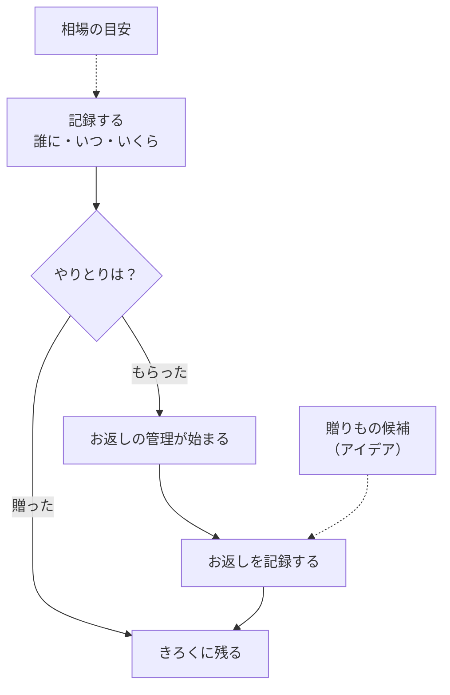
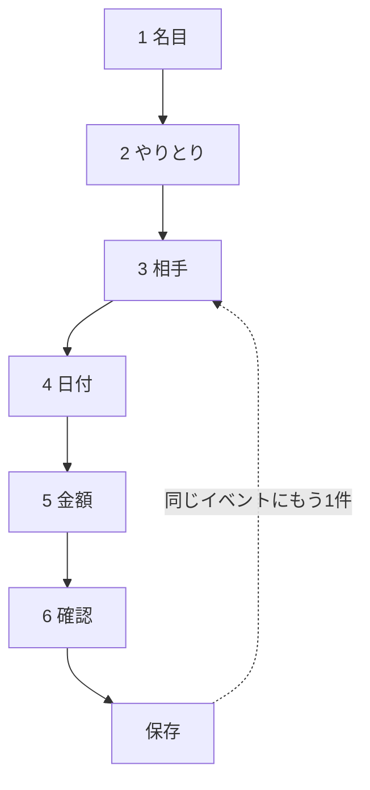
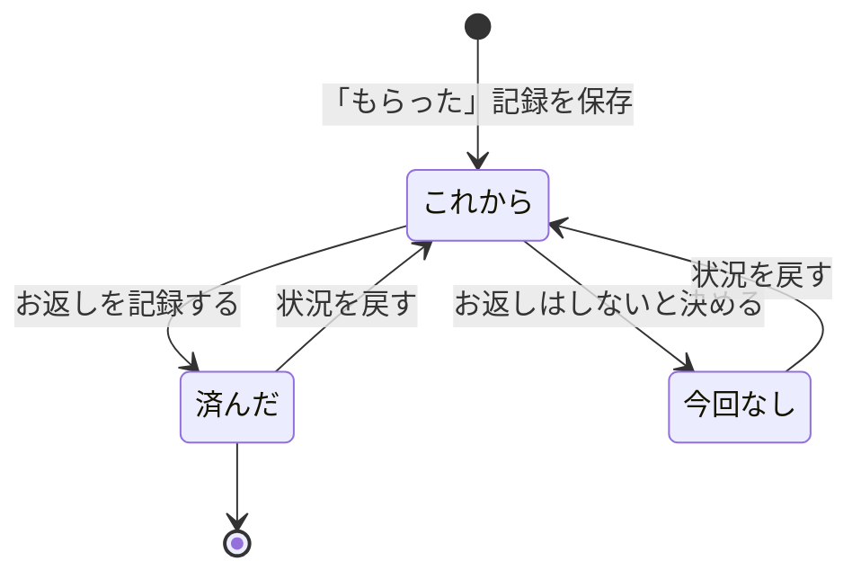
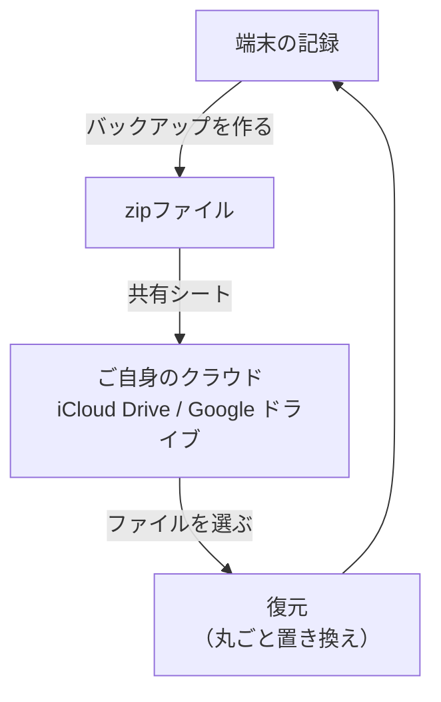

<!-- 自動生成: tsutsum/docs/user-guide.md から取り込んだもの。直接編集せず、原稿を直して `npm run sync:guide` を実行すること。 -->

ご祝儀・香典・お見舞いなどの「贈った／もらった」を記録して、お返しまで管理するアプリ **tsutsum** の使い方。

> **記録はすべて端末の中だけに保存されます。** サーバーには送られず、アカウント登録も要りません。
> そのぶん機種変更のときは、ご自身でバックアップを取っていただく必要があります（→ [15. バックアップと復元](#15-バックアップと復元)）。

> **図はすべてラフ画**（画面の構造を説明するための図）。実機の配色・余白・書体・写真とは異なる。
> 図に出てくる氏名・金額・日付はサンプル値。

## 用語

| 用語 | 意味 |
|---|---|
| 記録 | 「誰に・いつ・いくら包んだか／もらったか」の1件。 |
| 名目 | 結婚・葬儀・誕生日など、そのやりとりの理由。慶事・弔事・お見舞い・ギフトの4分類で全15種。 |
| やりとり | 「贈った」か「もらった」かの別。 |
| 相手 | 記録の相手。ご関係（家族・友人など）や住所・誕生日も持てる。 |
| 連名 | 「営業部一同」のように複数人でまとめた相手。人数を入れると1人あたりの額が出る。 |
| お返し | 「もらった」記録に自動で付く返礼の管理。これから／済んだ／今回なし の3つの状況を持つ。 |
| 候補（アイデア） | 「これを贈ろうかな」を写真やURLつきでためておくメモ。 |
| 相場の目安 | 名目 × ご関係の金額の幅。アプリに内蔵されていて、通信せずに引ける。 |

## 全体の流れ

「もらった」記録を保存すると、お返しの管理が自動で始まります。
「贈った」記録は、そのまま履歴として残ります。

---

# 第1部 はじめかた

## 1. tsutsum でできること

| No. | 場所 | 説明 |
|---|---|---|
| 1 | アイコン | 起動直後は画面中央にあり、立ち上がりで少し上へ収まる。 |
| 2 | アプリ名 | アイコンが収まったあとに現れる。 |
| 3 | ひとこと | アプリ名より少し遅れて現れる。 |
| 4 | 季節の背景 | 季節ごとの色と粒（花びら・落ち葉・雪など）が浮かぶ。 |

画面のどこかを押すと演出を飛ばして、すぐにアプリへ入れます。

画面は下の4つのタブに分かれています。

| タブ | 内容 |
|---|---|
| きろく | 記録の一覧。お返しやお祝いのお知らせもここに出る |
| ひと | 相手の一覧。相手ごとの履歴と収支をまとめて見られる |
| アイデア | 贈りもの候補のメモ |
| そのほか | 相場の目安・リマインド・バックアップなどの設定 |

## 2. はじめての記録 — 6つのステップ

記録は1画面に1つずつ答えていく形です。ページをまたいでも入力は保たれます。

葬儀の香典や結婚式のご祝儀のように何十件も登録するときは、保存後の「もう1件」から
**相手と金額だけの短縮ループ**に戻れます。名目・やりとり・日付は引き継がれます。

### 名目とやりとりを選ぶ

| No. | 場所 | 説明 |
|---|---|---|
| 1 | 閉じる | 何か入力していたら破棄の確認が入る（端末の戻る操作も同じ）。 |
| 2 | 進み具合 | 「水引の一本道」。いまの段階名と「n / 6」だけが出る。 |
| 3 | 大分類 | 慶事・弔事・お見舞い・ギフトの4つ。押すと同じ画面が種別の一覧に切り替わる。 |
| 4 | 分類名 | 押すと大分類の選び直しに戻る。 |
| 5 | 種別 | 選ぶとチェックが付き、そのまま次へ自動で進む。慶事6／弔事3／お見舞い1／ギフト5 の全15種。 |
| 6 | 贈った／もらった | 選ぶとそのまま次へ進む。「もらった」を選ぶと、保存後にお返しの目安が出る。 |
| 7 | 戻る | 2ステップ目以降に出る。 |

**名目の一覧**

| 分類 | 種別 |
|---|---|
| 慶事 | 結婚／出産／入学・入園／新築・引越／昇進・退職／その他のお祝い |
| 弔事 | 葬儀／法要／その他の弔事 |
| お見舞い | お見舞い |
| ギフト | 誕生日／お礼／お中元／お歳暮／その他の贈り物 |

### 相手・日付・金額を入れる

| No. | 場所 | 説明 |
|---|---|---|
| 1 | 新しい相手 | その場で相手を作れる。既存の相手を選ぶとこちらの選択は外れる。 |
| 2 | 個人／連名 | 切り替えると下の入力欄が変わる（個人＝ご関係／連名＝人数）。連名の名前は「営業部一同」のように入れる。 |
| 3 | ご関係 | 家族／親戚／友人／同僚／上司・目上／ご近所／その他。 |
| 4 | 検索 | 登録済みの相手が増えてきたときだけ出る。かな・カナ・漢字の表記ゆれを吸収する。 |
| 5 | 登録済みの相手 | 押すと選択の印が付く（ここは自動では進まない）。 |
| 6 | 日付 | 既定は今日。**選ばずに進んでよい唯一のステップ**。 |
| 7 | 日付を選ぶ | 2000年1月1日〜翌年12月31日から選べる。 |
| 8 | 相場の目安 | 名目とご関係から引いた金額の幅。該当するデータがあるときだけ出る。 |
| 9 | 目安を詳しく | その名目で相場の目安の画面を開く。 |
| 10 | 候補から選ぶ | 「贈った」記録のときだけ出る。選ぶと品物と金額が入る。 |
| 11 | キーボードの上のバー | 金額・品物・メモを行き来する。 |

**注意**

- 金額と品物は**どちらか一方が入っていれば保存できます**。両方でも構いません。
- 連名で人数を入れておくと、あとから1人あたりの額が出ます。

### 確認して保存する

| No. | 場所 | 説明 |
|---|---|---|
| 1 | 内容の一覧 | 入力したものだけが行として並ぶ。 |
| 2 | 写真を足す | カメラかライブラリから。**1件につき5枚まで**。右上の×で取り消せる。 |
| 3 | 保存する | 保存中は戻れない。失敗したときはこの画面に留まる。 |
| 4 | お返しの目安 | 「もらった」記録で金額が入っているときだけ出る。 |
| 5 | 同じイベントにもう1件 | 名目・やりとり・日付を引き継いで、相手の選択に戻る。 |
| 6 | 完了 | 閉じる。画面の外を押しても閉じない。 |

---

# 第2部 記録を見る・直す

## 3. きろく（タイムライン）の見かた

| No. | 場所 | 説明 |
|---|---|---|
| 1 | 挨拶ヘッダ | 上へスクロールすると、どの位置からでも戻ってくる。 |
| 2 | 虫めがね | 「相手を探す」。ひとタブへ移る。 |
| 3 | 記録する | 記録の入口。 |
| 4 | バックアップの案内 | 30日以上バックアップしていないときだけ出る。「あとで」で一定期間しまえる。 |
| 5 | お返し | 未対応があるときに出る。行を押すとお返しの記録へ。 |
| 6 | お祝いが近い相手 | 到来日の近い順に最大3件。無いときはセクションごと出ない。 |
| 7 | 月の見出し | 日付の新しい順。「YYYY年M月」で区切る。 |
| 8 | 記録の行 | 1行＝1件。右に金額または品名。お返しがまだの記録には淡い印が付く。 |

記録が0件のときは、代わりに「まだ記録がありません」と、記録する／目安を調べる への案内が出ます。

## 4. 記録の詳細を見る

| No. | 場所 | 説明 |
|---|---|---|
| 1 | 編集 | 記録を直す。 |
| 2 | 削除 | 確認のうえ削除する。写真も一緒に消える。**戻せない**。 |
| 3 | 金額 | 登録されているときだけ行が出る。 |
| 4 | 1人あたり | 連名で人数と金額が入っているときだけ。割り切れないときは「約 …」が付く。 |
| 5 | 品物・メモ | 登録されているときだけ行が出る。 |
| 6 | 写真を足す | 1件につき5枚まで。超えるとその場で知らせる。 |
| 7 | お返しの節 | **「もらった」記録のときだけ**ここから下が出る。 |
| 8 | お返しの状況 | 「これから」「今回なし」はその場で1タップ。「済んだ」だけ内容を記録する画面へ移る（記録を飛ばすこともできる）。 |
| 9 | 候補を紐づける | 既存の候補をこの相手に紐づける。 |
| 10 | 候補を作る | この相手・この記録に紐づけた状態で候補を新規作成する。 |
| 11 | 紐づいた候補 | 1件も無いときは「候補はまだありません。」と出る。 |

## 5. 記録を直す

| No. | 場所 | 説明 |
|---|---|---|
| 1 | 相手・やりとり | **変更できません**（記録の意味が変わってしまうため）。直したいときは削除して作り直します。 |
| 2 | 名目 | 「慶事・結婚」のように大分類つきで並ぶ。 |
| 3 | 日付 | 2000年1月1日〜翌年12月31日。 |
| 4 | 金額 | 数字以外は無視して取り込む。 |
| 5 | 保存 | 金額も品物も空だと押せない。 |
| 6 | キーボードの上のバー | 入力欄にフォーカスがあるときだけ出る。 |

---

# 第3部 相手とお返し

## 6. ひと（相手一覧）の見かた

| No. | 場所 | 説明 |
|---|---|---|
| 1 | 連絡先から取り込む | アドレス帳から**手動で1回だけ取り込む**（一方向）。事前説明は「続ける」だけで、閉じると端末の許可確認へ進む。 |
| 2 | 相手を追加 | 手で追加する。 |
| 3 | 検索 | 名前の部分一致。かな・カナ・漢字の表記ゆれを吸収する。 |
| 4 | 表示方式 | 横スクロールするピル列で切り替える。 |
| 5 | 相手の行 | 1行＝1人。副文は表示方式によって収支・誕生日・お返し件数に変わる。 |
| 6 | 関係ごとのタブ | 登録のある関係だけが件数つきで並ぶ。 |

**注意**

- 取り込みは**取り込むだけ**です。tsutsum 側の変更がアドレス帳に書き戻されることはありません。
- 相手が0人のときは「連絡先から取り込む」だけが出ます。

## 7. 相手を追加する・編集する

| No. | 場所 | 説明 |
|---|---|---|
| 1 | アイコン | 右下のバッジを押すとシートが開く（写真から選ぶ／カメラで撮る／外す）。 |
| 2 | アイコンの文言 | 未設定なら「アイコンを設定」、設定済みなら「アイコンを変える」。 |
| 3 | ご関係 | 家族／親戚／友人／同僚／上司・目上／ご近所／その他。 |
| 4 | 人数 | 連名の相手のときだけ出る。 |
| 5 | 誕生日 | 月・日はドロップダウン（「—」で未設定に戻せる）、年は任意。 |
| 6 | お祝いの通知 | 月と日が両方そろっているときだけ出る、この相手だけの切り替え。 |
| 7 | 住所・連絡先・メモ | すべて任意。香典返しの発送先などに使える。 |
| 8 | 保存 | お名前が入っていれば押せる（連名は人数も必要）。 |
| 9 | キーボードの上のバー | 入力欄にフォーカスがあるときだけ出る。 |

### アイコンを設定する

| No. | 場所 | 説明 |
|---|---|---|
| 1 | 写真から選ぶ | 選んだ画像を切り抜き画面へ渡す。 |
| 2 | カメラで撮る | 撮った写真も同じ切り抜き画面へ。 |
| 3 | 画像を外す | アイコンが設定されているときだけ出る。 |
| 4 | 位置を合わせる | 円形のガイドに合わせる。等倍〜5倍まで拡大できる。 |
| 5 | 決定 | 切り抜いた画像を返す。処理中は閉じられない。 |

## 8. 相手の情報を見る

| No. | 場所 | 説明 |
|---|---|---|
| 1 | 編集 | プロフィールの編集へ。 |
| 2 | 削除 | **記録が残っている相手は削除できません**。件数を添えて知らせます。 |
| 3 | プロフィール | 未入力の項目は「未登録」と細字で置く。 |
| 4 | 連絡先との紐づけ | アドレス帳と紐づいた相手にだけ出る。解除しても取り込んだ情報や記録は残る。 |
| 5 | 収支 | もらった・包んだの合計金額と件数。 |
| 6 | 候補を紐づける | 既存の候補をこの相手に紐づける。 |
| 7 | 候補を作る | この相手に紐づけた状態で新規作成する。 |
| 8 | 紐づいた候補 | 無いときは「候補はまだありません。」。 |
| 9 | この相手との記録 | 新しい順。無いときは「まだ記録がありません。」。 |

## 9. お返しを管理する

「もらった」記録には、保存と同時にお返しの管理が付きます。状況は3つです。

| No. | 場所 | 説明 |
|---|---|---|
| 1 | 絞り込み | 状況で切り替える。既定は「これから」。 |
| 2 | お返しの行 | 名目・日付・もらった金額（または品物）。「これから」のときだけ目安の行が付く。 |
| 3 | 目安 | もらった額の**3分の1〜半分**。連名は「1人あたり」が基準。名目ごとの時期の目安も添える。 |
| 4 | 候補から選ぶ | アイデアにためた候補から選ぶ。品物名が入り、金額が空なら目安金額も入る。 |
| 5 | 日付 | 既定は今日。 |
| 6 | 保存 | **全項目が任意**。何も入れずに押して、状況だけ「済んだ」にもできる。 |
| 7 | 急かさない一文 | あとから記録しても構いません。 |

**注意**

- 「贈った」記録にはお返しの管理は付きません。
- 金額の目安は**幅**で出します。正解を断定するものではありません。

## 10. 相場の目安を調べる

いくら包めばよいか迷ったときに引きます。通信しないので圏外でも使えます。

| No. | 場所 | 説明 |
|---|---|---|
| 1 | 名目 | 相場データを持つ名目だけが並ぶ。 |
| 2 | 金額の表 | ご関係ごとの金額の幅。7つの関係すべてを並べ、データが無い組み合わせは「—」。 |
| 3 | 弔事の注記 | 弔事の名目のときだけ添える。 |
| 4 | 注意書き | 常に最後に置く。 |

記録の「金額」のステップからも、その名目を選んだ状態で開けます。

---

# 第4部 贈りもの候補（アイデア）

## 11. 候補をためる

「これを贈ろうかな」を思いついたときにためておく場所です。お返しを記録するときに、ここから選べます。

| No. | 場所 | 説明 |
|---|---|---|
| 1 | 候補を追加 | 新しい候補を作る。 |
| 2 | 一覧／アーカイブ | 「アーカイブ」はしまった分。既定は「一覧」。 |
| 3 | 写真ありのタイル | サムネイルの上にタイトルを重ねる。左上に紐づけた相手、右上に「…」。 |
| 4 | 写真なしのタイル | タイトル主役。目安金額とメモ抜粋を控えめに添える。 |
| 5 | グリッド | 新しい順。画面の幅に応じて列数が変わる。 |
| 6 | リンクを開く | 候補にURLが入っているときだけ出る。 |
| 7 | アーカイブ | アーカイブ中の候補では「一覧に戻す」に変わる。 |
| 8 | 削除 | 確認のうえ削除し、写真も消える。**戻せない**。 |

## 12. 候補を追加する・編集する

| No. | 場所 | 説明 |
|---|---|---|
| 1 | 名前 | **唯一の必須項目**。ここが空だと保存できない。 |
| 2 | 相手のチップ | 選んだ相手。×で個別に外せる。 |
| 3 | 相手を選ぶ | 検索つきの複数選択。相手が1人もいないときはこの節ごと出ない。 |
| 4 | 写真 | **1枚だけ**。設定済みならサムネイルに変わり、右上の×で外せる。 |
| 5 | 保存 | 名前が入っていれば押せる。 |

記録の詳細や相手の情報から作ると、その相手・記録に紐づいた状態で始まります。

## 13. 候補の詳細

| No. | 場所 | 説明 |
|---|---|---|
| 1 | 編集 | 候補の編集へ。 |
| 2 | 「…」 | アーカイブ・削除のシートを開く。 |
| 3 | 写真 | 登録されているときだけ、先頭に大きく出る。 |
| 4 | 目安金額 | 入っているときだけ出る。 |
| 5 | リンク | 押すと外部ブラウザで開く。 |
| 6 | メモ | 入っているときだけ節ごと出る。 |
| 7 | 紐づいた相手 | 押すとその相手の情報へ。1人もいなければ節ごと出ない。 |
| 8 | アーカイブ | アーカイブ中は「一覧に戻す」に変わる。 |
| 9 | 削除 | 確認のうえ削除し、写真も消える。**戻せない**。 |

---

# 第5部 通知・データ・設定

## 14. リマインドを設定する

お返しの時期や、お祝いの日が近づいたときに知らせます。

| No. | 場所 | 説明 |
|---|---|---|
| 1 | 名目ごとのリマインド | リマインドを持つ名目だけが並ぶ（葬儀・結婚・出産・お見舞い・誕生日・お中元・お歳暮の7つ）。 |
| 2 | 日数 | 「◯日後」（もらった日から）は 7/10/14/21/30/42/49、「◯日前」（到来日に向けて）は 3/5/7/10/14/21/30。 |
| 3 | オフの行 | 日数を出さず「オフ」と表示する。 |
| 4 | お祝いのリマインド | 記録によらないお祝い。誕生日は「誕生日を登録した相手」、長寿は「生まれ年のある相手」が対象。 |
| 5 | 通知の許可 | オンにするとき端末の許可を求める。許可されなければオフのまま戻る。 |

## 15. バックアップと復元

記録は端末の中だけにあります。**機種変更や端末の故障に備えて、ときどきバックアップを取ってください。**

| No. | 場所 | 説明 |
|---|---|---|
| 1 | 最終バックアップ | 一度も取っていなければ「まだバックアップしていません」と出る。 |
| 2 | バックアップを作る | zipを作って共有シートに渡す。保存・送信が完了したときだけ日時が更新される。 |
| 3 | 保存先の案内 | 端末によって文言が変わる（iOS＝iCloud Drive、Android＝Google ドライブ）。 |
| 4 | 復元 | zipを選び、壊れていないか・アプリより新しくないかを確かめてから、いまの記録の件数を添えて確認する。 |
| 5 | 自動バックアップの案内 | 案内のみで操作はない。 |

**注意**

- 保存先は**ご自身のクラウド**です。開発者側にデータは渡りません。
- 復元するとデータは**丸ごと置き換わり**、いまの記録は消えます。**取り消せません**。
- アプリより新しいバージョンで作られたバックアップは読み込めません。先にアプリを更新してください。

## 16. そのほかタブ

| No. | 場所 | 説明 |
|---|---|---|
| 1 | 相場の目安 | 名目・ご関係から金額の目安を引く。 |
| 2 | リマインド | お返し・お祝いの通知の設定。 |
| 3 | バックアップ | ファイルへの書き出しと読み込み。 |
| 6 | レビューを書く | ストアのレビューを外部ブラウザで開く。 |
| 7 | お問い合わせ | 問い合わせフォームを開く。 |
| 8 | 規約・プライバシー | いずれも外部ブラウザで開く。 |
| 9 | アプリの情報 | アプリ名とバージョン。表示のみ。 |
| 10 | ライセンス | 同梱ライブラリのライセンス一覧を開く。 |

> 図の 4「エクスポート」と 5「tsutsum Pro」は準備中の項目で、いまは表示されません。

---

# 巻末

## 困ったとき

| 症状 | 対処 |
|---|---|
| 相手を削除できない | その相手の記録が残っています。先に記録を消してから削除してください。 |
| 記録の相手／贈った・もらったを直したい | この2つは変更できません。削除して作り直してください。 |
| 保存ボタンが押せない | 記録は金額か品物のどちらかが必要です。相手は名前（連名は人数も）、候補は名前が必要です。 |
| 写真がこれ以上追加できない | 記録は1件5枚まで、贈りもの候補は1枚までです。 |
| お返しの節が出てこない | 「もらった」記録にだけ出ます。「贈った」記録には付きません。 |
| 通知が来ない | リマインドの設定がオフか、端末側で通知が許可されていない可能性があります。 |
| 相場の目安に金額が出ない | その名目とご関係の組み合わせにデータがありません（「—」で表示されます）。 |
| バックアップを読み込めない | ファイルが壊れているか、いまのアプリより新しいバージョンで作られています。アプリを更新してからお試しください。 |
| 機種変更したい | 旧端末でバックアップを作り、新端末で復元してください（→ [15. バックアップと復元](#15-バックアップと復元)）。 |
| それでも解決しない | そのほかタブ → お問い合わせ（`https://ynetlabo.net/contact`）からご連絡ください。 |

## プライバシーについて

- 記録・写真はすべて**端末の中**に保存されます。サーバーには送られません。
- アカウント登録は不要です。
- バックアップの保存先は、ご自身のクラウド（iCloud Drive／Google ドライブ）です。
- 連絡先の取り込みは、許可したときに**一度だけ・取り込む方向のみ**行います。
