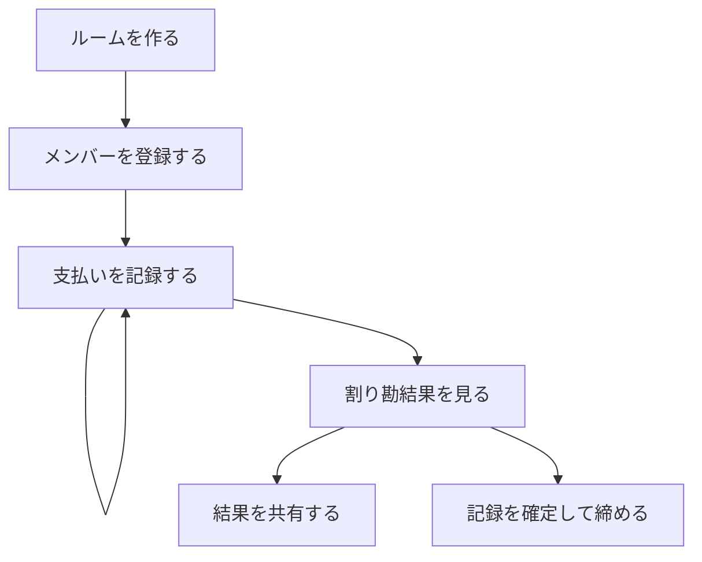
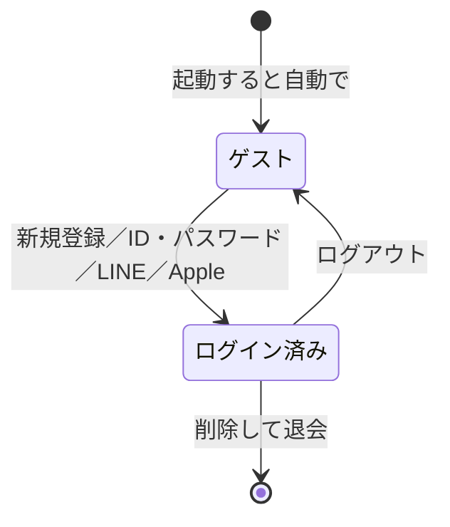
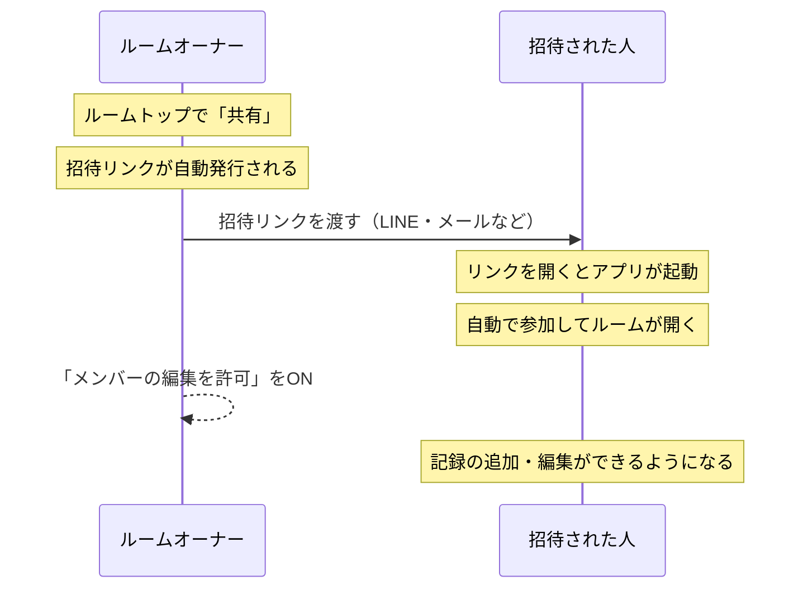
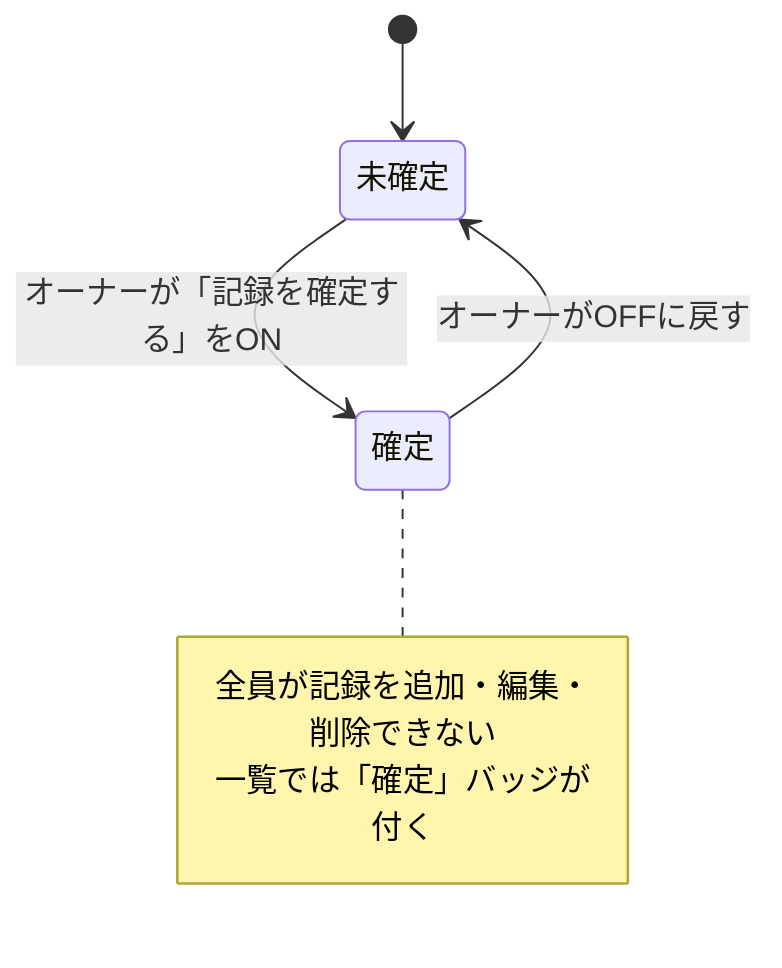

<!-- 自動生成: wari-ios/docs/user-guide/user-guide.md から取り込んだもの。直接編集せず、原稿を直して `npm run sync:guide` を実行すること。 -->

割り勘アプリ **wa/ri** の使い方。
旅行や飲み会の支払いをその場で記録しておくと、「誰が誰にいくら払えば終わりか」を計算してくれる。

> **図はすべてラフ画**（画面の構造を説明するための図）。実機の配色・余白・書体とは異なる。
> 図に出てくる氏名・金額・日付・IDはサンプル値。

## 用語

| 用語 | 意味 |
|---|---|
| ルーム | 1つのイベント（旅行・飲み会など）の入れ物。記録とメンバーがぶら下がる。 |
| メンバー | 割り勘の対象になる人。名前だけで登録でき、アプリのアカウントとは別物。 |
| 記録 | 1件の支払い、または集金。 |
| 支払（立替） | 1人が立て替えて、N人で割る。割り勘の計算に入る。 |
| 集金 | 1人が1人から受け取る。割り勘のプールには入らない、メンバー間の受け渡しの記録。 |
| 一時記録 | ルームを決めずに金額だけ控えるメモ。端末の中にだけ保存される。 |
| 確定 | ルームの記録をロックして、追加・編集・削除をできなくすること。 |
| ルームオーナー | ルームを作った人。管理操作ができる。 |
| 参加者 | 招待リンクから入った人。 |
| ゲスト | アカウントを作らずに使っている状態。 |

## 全体の流れ

メンバーを増やしたいとき・支払いが増えたときは、いつでも戻って足せる。
ほかの人にも入力してもらいたいときは、[メンバーを招待する](#10-メンバーを招待する)へ。

---

# 第1部 はじめかた

## 1. wa/ri でできること

はじめて開くと、全7ページのチュートリアルが出る。あとから 設定 → チュートリアルでいつでも見直せる。アップデートでページが増えたときは、既存ユーザーには増えたページだけが「アップデート情報」として出る。

| No. | 場所 | 説明 |
|---|---|---|
| 1 | 起動中の表示 | ログイン状態の確認とバージョンチェックをしている。ログイン済みなら「ようこそ、○○さん」に変わる。 |
| 2 | スキップ | いつでも飛ばせる。飛ばしても「見た」ことになり、次回から出ない。 |
| 3 | ページ | ①ルーム作成 ②記録の追加 ③割り勘結果 ④外貨対応 ⑤さぁ始めましょう の5ページ。左右スワイプでも進む。 |
| 4 | 次へ | 最終ページでは「はじめる」になる。 |

**注意**

- サーバに繋がらないときは、トップメニューではなく[オフライン画面](#21-圏外オフラインのとき)に入る。
- アップデートでページが増えたときは、既存の利用者には増えた分だけが「アップデート情報」として出る。
- チュートリアルを終えたあと、広告トラッキングの説明が一度だけ出る（→ [許可とお願いのダイアログ](#許可とお願いのダイアログ)）。

## 2. はじめての割り勘 — 3ステップ

ルームを作る → 支払いを記録する → 割り勘結果を見る。この3つだけで精算できる。

| No. | 場所 | 説明 |
|---|---|---|
| 1 | クイックスタート | ONにすると人数分のメンバー（自分・A・B…）が自動で登録されるので、メンバー登録の手間が省ける。 |
| 2 | 「作成」ボタン | 作成するとそのままルームトップへ移動する。 |
| 3 | 誰が払った？ | 立て替えた人を1人選ぶ。 |
| 4 | 誰で割る？ | 初期状態は全員が対象。外したい人だけタップして解除する。 |
| 5 | 「登録」ボタン | 連続登録をONにしておくと、続けて次の支払いを入力できる。 |
| 6 | 割り勘結果の行 | この人に払う相手と金額。1行が1回の送金にあたる。 |

## 3. アカウントは必要？ ゲストのままだとどうなる

アカウントを作らなくても（ゲストのまま）すべての機能が使える。
ただしゲストのデータは**その端末だけ**のもので、一定期間で消える可能性がある。

| ゲストのままでも | アカウントを作ると |
|---|---|
| ルームの作成・記録・割り勘・共有はすべてできる | 同じアカウントで他の端末からも同じルームを開ける |
| データはこの端末だけ。**一定期間で消える可能性がある** | 機種変更しても引き継げる |

作り方と引き継ぎは [20. アカウントの管理・引き継ぎ・退会](#20-アカウントの管理引き継ぎ退会)へ。

---

# 第2部 基本の使い方

## 4. ルームを作る

トップメニューの「新規作成」から。イベント名を入れるだけでよい。

| No. | 場所 | 説明 |
|---|---|---|
| 1 | ヘルプ | この画面の使い方ガイドをアプリ内ブラウザで開く。 |
| 2 | テンプレート | 「YYYY.MM.DD わりかん／飲み会／お食事会／おでかけ／あそび」の5種からルーム名に流し込む。 |
| 3 | ルーム名 | 空のまま登録すると「ルーム名を正しく入力してください」で弾かれる。 |
| 4 | アイコン | 一覧やルームトップの見出しに使われる。 |
| 5 | クイックスタート | ONにすると、指定人数分のメンバーを作成と同時に自動登録する。 |
| 6 | 人数 | 2〜20人。クイックスタートがOFFのときは操作できない。 |
| 7 | 通貨 | 既定値は設定の「新規ルームの通貨」に従う。**作成後は変更できない**。 |
| 8 | 「作成」ボタン | 作成するとそのままルームトップへ移動する。 |

**注意**

- 通貨だけは後から変えられない。海外旅行で使うなら作るときに決める（→ [17. 海外旅行で使う](#17-海外旅行で使う外貨ルーム)）。
- 既存ルームの設定変更は [12. 記録を確定して締める](#12-記録を確定して締める)を参照。

## 5. ルームトップの見かた

1ルームの入口。上半分が「見る」、下半分が「管理する」。

| No. | 場所 | 説明 |
|---|---|---|
| 1 | ヘルプ | この画面の使い方ガイドを開く。 |
| 2 | 鍵アイコン | ルームの設定へ。確定済みなら閉じた鍵になる。オーナー以外は押せない。 |
| 3 | 共有ボタン | 招待リンクの共有と、CSV／PDF出力。中央の「共有」も同じ画面。 |
| 4 | ルーム情報 | タップでルーム設定。オーナー以外は押せない。 |
| 5 | メンバー | 横スクロールで全員見られる。0人のときは「ここをタップしてメンバーを追加する」が出る（オーナーのみ）。 |
| 6 | 合計カード | 支払いの合計と件数。カード全体がタップ領域で、記録の一覧へ移動する。 |
| 7 | 「割り勘」ボタン | 誰が誰にいくら払えば精算できるかを計算する。 |
| 8 | 「記録」ボタン | 支払い／集金を1件登録する。確定済みルームや編集不可の参加者では押せない。 |
| 9 | 「レシート一括登録」ボタン | レシートを撮って明細をまとめて登録する。記録画面が明細モードで開き、そのまま読み取りに入る（→ [14. レシートをカメラで読み取る](#14-レシートをカメラで読み取る)）。記録を編集できて、円のように小数のない通貨のルームのときだけ出る。 |

下へスクロールすると「ルーム管理」が出る。

| No. | 場所 | 説明 |
|---|---|---|
| 10 | メンバーの設定 | 割り勘の対象になる人を登録する。オーナー以外は閲覧のみ。 |
| 11 | ルームの設定 | ルーム名・アイコン・確定・メンバー編集許可。オーナー限定。 |
| 12 | CSV出力 | 記録を1件1行のCSVに書き出す。 |
| 13 | PDF出力 | 合計・カテゴリ別の円グラフ・割り勘方法・記録の一覧をまとめたPDFを書き出す。記録が0件のときは「出力できる記録がありません」で止まる。 |
| 14 | ルームから抜ける | 招待された人だけに出る。記録は消えない。 |
| 15 | ルームを削除する | オーナーのみ。記録ごと消える。**元に戻せない**。 |

**注意**

- オーナー以外には、オーナー限定の行に「🔒 ルームオーナーのみ操作できます」が付いて操作できない。
- メンバーが1人も登録されていないルームを開くと、自動で「メンバーの設定」へ移動する（1回だけ）。

## 6. メンバーを登録する

「メンバー」は割り勘の対象になる人。アプリのアカウントとは別で、名前だけで登録できる。

| No. | 場所 | 説明 |
|---|---|---|
| 1 | 右上の追加 | オーナー以外には表示されない。 |
| 2 | 「メンバーを追加」 | 追加シートを開く。 |
| 3 | メンバーの行 | タップで名前の変更・削除。オーナー以外はタップできない。 |
| 4 | ヘルプ | この画面の使い方ガイドを開く。 |
| 5 | 名前 | 自由入力。空のままでも、下の履歴を選んでいれば登録できる。 |
| 6 | よく参加するメンバー名 | 自分が過去に作ったルームで使った名前の一覧。タップで選択／解除。 |
| 7 | 連続登録 | ONにすると登録後もシートが閉じず、続けて次のメンバーを入力できる。 |
| 8 | 「追加」ボタン | 入力欄と選択中の名前をまとめて登録する。名前が1つも無いと「メンバー名が設定されていません」で止まる。 |

**注意**

- メンバーの追加・変更・削除はすべて**ルームオーナー限定**。参加者には案内文に置き換わる。
- **記録があるメンバーは削除できない**（「既に記録がある場合は削除できません。」）。先にその人の記録を消す。

## 7. 支払いを記録する

「誰が払った」「誰で割る」「いくら」の3つを選ぶだけ。

| No. | 場所 | 説明 |
|---|---|---|
| 1 | ヘルプ | この画面の使い方ガイドを開く。 |
| 2 | 支払／集金 | 切り替え。集金については [16. 集金を記録して精算を追う](#16-集金を記録して精算を追う)へ。**既存の記録を編集するときは切り替えられない**。 |
| 3 | 誰が払った？ | 集金モードでは「誰が集金した？」に変わる。 |
| 4 | 立て替えた人 | 1人だけ選べる。メンバーが0人のときは「メンバーの設定から、メンバー登録をしてください。」と出る。 |
| 5 | 誰で割る？ | 集金モードでは「誰から集金した？」に変わり、選べるのは1人だけになる。 |
| 6 | 明細で分ける | 1回のお会計を品目ごとに分けて登録する形に切り替える。品目によって割り勘の対象が違うときに使う（→ [15. 1回のお会計を明細ごとに分ける](#15-1回のお会計を明細ごとに分ける)）。 |
| 7 | 割り勘の対象 | 初期状態は全員が選択済み。タップで外す／戻す。 |
| 8 | 一時記録から復元 | 控えておいたメモから日付・金額・カテゴリ・メモを流し込む（→ [13. 一時記録](#13-あとで登録する一時記録)）。 |
| 9 | カメラで読み取る | レシートの合計金額を自動で読み取る（→ [14. レシートをカメラで読み取る](#14-レシートをカメラで読み取る)）。 |
| 10 | 金額 | 1以上の整数。外貨ルームでは通貨バッジが出る。 |
| 11 | カテゴリ | 飲食・交通・宿泊・アクティビティ・その他など。集金モードでは集金用だけが並ぶ。 |
| 12 | 連続登録 | ONにすると登録後もシートが閉じず、メンバー選択を保ったまま次の記録を入力できる。 |
| 13 | 「登録」ボタン | 確定済みルームでは「このルームの記録は確定済みです。」で拒否される。 |

**記録できる人**

| | 記録の追加・編集・削除 |
|---|---|
| ルームオーナー | ○ |
| 参加者（編集を許可された） | ○ |
| 参加者（許可なし） | ✕ |
| 確定済みのルーム | オーナーを含め全員✕ |

## 8. 記録を見なおす・直す

ルームトップの合計カードから開く。4つのタブは同じ記録を切り口を変えて見せる。

| No. | 場所 | 説明 |
|---|---|---|
| 1 | ヘルプ | この画面の使い方ガイドを開く。 |
| 2 | 記録を追加 | 編集できない参加者では押せない。 |
| 3 | グラフ | そのタブの集計グラフ。タブごとに日別／メンバー別／カテゴリ別に変わる。 |
| 4 | 記録の行 | 1行が1件の支払い。**タップで編集シートが開く**。右端は割り勘対象の人数。 |
| 5 | タブ | 4つの切り口。下の表を参照。 |

| タブ | 見えるもの |
|---|---|
| 日別 | 日付ごと → 立て替えた人ごとにまとめる |
| メンバー別 | 立て替えた人ごとの合計と明細 |
| カテゴリ別 | 飲食・交通・宿泊などカテゴリごとの合計と明細 |
| 集金 | 集金の記録だけ。1件も無いとタブ自体が出ない |

**注意**

- 集金は支出ではないので、他3タブの合計には含まれない。
- 記録が0件のときは「記録がありません」とだけ出る。
- 記録を消すときは、行をタップして開いた編集シートの「削除」から（確認が1段入る）。
- 明細に分けて登録した会計は、小見出しと縦線で1つのまとまりとして並ぶ。まとまりの中の行をタップすると、1件ではなく会計ごと開く（→ [15. 1回のお会計を明細ごとに分ける](#15-1回のお会計を明細ごとに分ける)）。

## 9. 割り勘結果を見る

「誰が誰にいくら払えば精算が終わるか」を、受け取る人ごとにカードでまとめた結果。

| No. | 場所 | 説明 |
|---|---|---|
| 1 | ヘルプ | この画面の使い方ガイドを開く。 |
| 2 | 画像で共有 | いまの表示のまま1枚の画像にして、プレビューを見てから他アプリへ渡せる。 |
| 3 | 3つのトグル | 押すたびにON（橙）とOFF（グレー）が入れ替わる。下の表を参照。 |
| 4 | カードの見出し | この人が受け取る合計。内訳は「立て替えた額 − 負担する額」。割り切れないときは「あまり」が付く。 |
| 5 | 精算不要の行 | 貸し借りが相殺された行。取り消し線が入りグレーになる。 |
| 6 | 計算過程 | 「詳細表示」がONのときだけ、点線の下に出る。 |
| 7 | 実際に払う行 | ピンクで「From」バッジが付く。1行が1回の送金にあたる。 |

| トグル | 効果 |
|---|---|
| 詳細表示 | 金額に至った計算過程（立替・相殺の内訳）を明細の下に出す |
| まとめる | 支払いを可能な限り束ねて、送金の回数を減らす |
| 0円消し | 精算の必要がなくなった行を一覧から消す |

---

# 第3部 みんなで使う

## 10. メンバーを招待する

招待できるのは**ルームオーナー**だけ。リンクを渡すと、相手はそのルームを開けるようになる。

| No. | 場所 | 説明 |
|---|---|---|
| 1 | 共有ボタン | 右上の共有、または中央の「共有」を押す。 |
| 2 | 招待リンクを共有 | LINE・メールなど好きな方法でリンクを渡す。 |
| 3 | メンバーの編集を許可 | **ONにしないと、招待した相手は記録を見るだけ**で追加・編集ができない。 |
| 4 | 参加完了 | 以降は相手のトップメニューの一覧にも並ぶ。権限は「参加者」。 |

| No. | 場所 | 説明 |
|---|---|---|
| 1 | ヘルプ | この画面の使い方ガイドを開く。 |
| 2 | 招待リンクを共有 | リンクが未発行のときは、オーナーが画面を開いた時点で自動発行される。 |
| 3 | メンバーの編集を許可 | 切り替えると即座に保存される。オーナー以外は操作できない。 |
| 4 | CSV出力 | 記録を1件1行のCSVに書き出す。 |
| 5 | PDF出力 | 合計・カテゴリ別の円グラフ・割り勘方法・記録の一覧をまとめたPDFを書き出す。 |

**注意**

- 招待リンクを作れるのはオーナーだけ。参加者には「招待リンクはまだ作成されていません。ルームオーナーに作成を依頼してください。」と出る。
- 招待リンクを渡した相手は誰でも参加できる。関係のない人に転送されないよう注意する。

## 11. 招待された側の見え方と、できること・できないこと

招待された人（参加者）は、記録を見ることはできるが、管理操作はできない。
記録を書き込めるかどうかは、オーナーが「メンバーの編集を許可」をONにしているかで決まる。

| 操作 | ゲスト（自分のルーム） | 参加者（編集不可） | 参加者（編集可） | ルームオーナー |
|---|---|---|---|---|
| 記録を見る | ○ | ○ | ○ | ○ |
| 記録を追加・編集・削除 | ○ | ✕ | ○ | ○ |
| メンバーを追加・変更・削除 | ○ | ✕ | ✕ | ○ |
| ルーム設定（名前・確定・編集許可） | ○ | ✕ | ✕ | ○ |
| 招待リンクを発行 | ○ | ✕ | ✕ | ○ |
| 招待リンクを共有 | ○ | ○ | ○ | ○ |
| CSV／PDF出力 | ○ | ○ | ○ | ○ |
| ルームから抜ける | — | ○ | ○ | ✕（削除のみ） |
| ルームを削除 | ○ | ✕ | ✕ | ○ |

**注意**

- ルームが確定済みのときは、**オーナーを含む全員**が記録を追加・編集・削除できない。
- 参加者がやめたいときは、ルームトップの「ルームから抜ける」。記録は残る。
- アクセス権のないルームを開こうとすると「表示しようとしているルームにアクセスできません」と出る。

## 12. 記録を確定して締める

精算が済んだら「確定」にしておくと、あとから記録が変わらない。

| No. | 場所 | 説明 |
|---|---|---|
| 1 | ヘルプ | この画面の使い方ガイドを開く。 |
| 2 | ルーム名 | 空にすると「ルーム名を正しく入力してください」で弾かれる。 |
| 3 | アイコン | ルームのアイコンを変更する。 |
| 4 | 記録を確定する | ONにすると記録の追加・編集・削除ができなくなる。一覧では「確定」バッジが付く。 |
| 5 | メンバーの編集を許可 | ONにすると、招待した参加者も記録を追加・編集できる。 |
| 6 | 「保存」ボタン | オーナー以外は押せない（サーバ側でも拒否される）。 |

**注意**

- 通貨とクイックスタートは新規作成時だけの項目で、この画面には出ない。
- 確定したルームを一覧から隠したいときは、[19. 設定でできること](#19-設定でできること)の表示設定で「確定済みを隠す」をONにする。

---

# 第4部 もっと便利に

## 13. あとで登録する「一時記録」

その場ではルームもメンバーも決められないとき、金額だけ先に控えておくメモ。
トップメニューの「一時記録」から追加できる。

| No. | 場所 | 説明 |
|---|---|---|
| 1 | 金額 | 1以上の整数。金額だけ入っていれば保存できる。 |
| 2 | 「保存」ボタン | 保存するとトップメニューの「一時記録」に並ぶ。 |

使うときは、記録画面の「一時記録から復元」を押して選ぶ。日付・金額・カテゴリ・メモが流し込まれ、
**登録するとその一時記録は消える**。

**注意**

- 一時記録は**端末の中だけ**に保存される。他の端末とは同期されない。
- 「一時記録から復元」が出るのは、新規登録・支払モード・一時記録が1件以上あるときだけ。
- 既存の一時記録をタップすると編集になり、下部が「削除」＋「変更を保存する」に変わる。

## 14. レシートをカメラで読み取る

レシートの読み取りは2通りある。**合計金額だけ**を金額欄に入れる読み取りと、
**明細をまとめて取り込む**読み取り。

> レシートの読み取りは iOS 版・Android 版の機能。Web 版では手入力になる。

### 合計金額だけを読み取る

記録画面の金額欄の横にあるカメラボタンから、レシートの合計金額を読み取れる。

1. カメラボタンを押してレシートにカメラを向ける
2. 合計金額が自動で認識される
3. 確定すると金額欄に入る

日本語・英語のレシートに対応している。読み取れなかったときは手で入力する。

### レシートから明細をまとめて読み取る

品名と金額を1件ずつ手で入れる代わりに、**レシートを1枚撮るだけ**で明細・日付・店名をまとめて取り込める。
入口は2つ。

- ルームトップの**「レシート一括登録」**（→ [5. ルームトップの見かた](#5-ルームトップの見かた)）
- 記録画面を明細モードにしたときの**「レシートから読み取る」**（→ [15. 1回のお会計を明細ごとに分ける](#15-1回のお会計を明細ごとに分ける)）

撮ると読み取り結果の確認画面が出る。**撮っただけでは登録されない。** ここで内容を確かめてから取り込む。

| No. | 場所 | 説明 |
|---|---|---|
| 1 | キャンセル | 取り込まずに閉じる。 |
| 2 | 日付・会計メモ | レシートから読み取った日付と店名。日付はそのまま会計の日付になり、**会計メモが空のときだけ**店名が入る（2枚目を足すときに、書いたメモを消さないため）。 |
| 3 | カテゴリ | 取り込む明細**すべて**に付くカテゴリ。取り込んだあと、明細ごとに変えられる。 |
| 4 | 割り勘の対象は？ | 取り込む明細**すべて**の対象。既定は全員。1人も選んでいないと取り込めない。 |
| 5 | 明細 | 読み取れた明細。既定ですべて選択済みで、要らない行だけタップで外す。 |
| 6 | 全選択／全解除 | まとめて選び直す。 |
| 7 | 取り込む合計 | 選んでいる明細の合計。 |
| 8 | 注記 | 金額をどう足し引きしたかの説明（下記）。 |
| 9 | 撮り直す | 読み取り直す。選び直した内容は消える。 |
| 10 | 「N件を取り込む」 | 選んだ明細を記録画面へ入れる。 |

**金額はレシートの印字そのままとは限らない**

行の2段目に「印字￥1,280　値引 -￥256　外税 +￥102」のような内訳が出る。

| レシートの書きかた | wa/ri の扱い |
|---|---|
| 値引き（「セール値引 -￥8」など） | **直前の明細から引く**。値引きが直前の品より大きいときは、その品ごと取り込まない。 |
| 外税（「外税 8% ￥56」など） | **税率ごとに、その税率の対象になる明細へ配る**。「※」「*」の付いた軽減税率の品と、印の無い品を分けて計算する。「込」「非」の品には配らない。 |
| どちらでも説明がつかない差額 | **「不明」という1行**にして足す。税として配ると金額が誰かに偏るため、勝手に振り分けない。読み落とした品かもしれないので、取り込んだあとに確かめる。 |

割り勘では「誰が何を食べたか」に税も付いて回るべきなので、税だけ別枠にはしない。
取り込んだ明細の合計は、レシートの合計とぴったり合うようにしている。

**読み取れなかったとき**

- 「明細を読み取れませんでした。」と出たら、明るいところでレシート全体が入るように撮り直す。
- 品名の誤読は、取り込んだあとに明細をタップして直せる。
- 撮るのは**1枚まで**。レシートが2枚あるときは、1枚ずつ取り込む（2枚目の明細は続けて足される）。

読み取りは端末の中だけで行う。**レシートの画像はどこにも送信しない。**

## 15. 1回のお会計を明細ごとに分ける

居酒屋でお酒を飲んだ人と飲まなかった人がいる、コンビニで自分のぶんと共用のぶんをまとめて買った ——
**1回の会計の中で、品目によって割り勘の対象が違う**ときに使う。

これまでは会計を分けて何件も登録するしかなかったが、
1回の会計としてまとめたまま、明細ごとに対象を変えられる。

### 明細に分けて記録する

記録画面の「割り勘の対象は？」の横にある**「明細で分ける」**を押すと、この形に変わる。

| No. | 場所 | 説明 |
|---|---|---|
| 1 | 支払／集金 | 集金に切り替えると明細モードは解除される。集金は1人が1人から受け取る記録なので、明細に分ける余地が無い。 |
| 2 | 誰が代わりに支払った？ | 立て替えた人は**会計全体で1人**。明細ごとには変えられない。 |
| 3 | レシートから読み取る | レシートを撮って、日付・会計メモ・明細をまとめて取り込む（→ [14. レシートをカメラで読み取る](#14-レシートをカメラで読み取る)）。円のように小数のない通貨のルームでだけ出る。 |
| 4 | まとめて1件にする | 通常の記録に戻す。明細をすでに入れていると「入力した明細を破棄しますか？」の確認が入る。 |
| 5 | 会計メモ | この会計に付ける名前。一覧では会計の小見出しになる。空のままなら「まとめて記録」と表示される。 |
| 6 | 明細の行 | カテゴリ・品名・割り勘の対象・金額。**タップで編集**。 |
| 7 | 明細を追加 | 明細を1件足す。まだ1件も無いときは枠が大きくなる。 |
| 8 | この会計での各自の負担 | 明細を入れるたびに更新される。レシートと突き合わせてから登録できる。 |
| 9 | 「N件を記録する」 | 明細の件数ぶんの記録を1回でまとめて登録する。 |

**登録できないとき**

| メッセージ | 直しかた |
|---|---|
| 立て替えた人を1人選んでください | 立替者が未選択。 |
| 明細を1件以上入力してください | 明細が0件。 |
| 金額が入っていない明細があります | 金額が空の明細がある。 |
| 割り勘の対象が選ばれていない明細があります | 対象が1人も選ばれていない明細がある。 |

### 明細1件を入力する

| No. | 場所 | 説明 |
|---|---|---|
| 1 | キャンセル | 入力を捨ててシートを閉じる。 |
| 2 | 金額 | 1以上。外貨ルームでは通貨バッジが出る。 |
| 3 | この明細は誰の分？ | この明細を誰で割るか。新規追加のときは全員が選択済みで開く。**1人だけ選べばその人の負担**になる。 |
| 4 | 全選択／全解除 | 人数が多いルームで、1人だけ外したいときに使う。 |
| 5 | カテゴリ | **明細ごと**に持つ。会計にひとつだけ持たせる形にはしていない（1回の会計でも品目でカテゴリが違うため）。初期値は「未設定」。 |
| 6 | 削除 | この明細を消す（確認が1段入る）。新規追加のときは出ない。 |
| 7 | 「明細を追加」／「変更する」 | 金額が空、または対象が1人も選ばれていないときは押せない。 |

**このシートを閉じた時点ではまだ登録されない。** 会計として保存するのは、呼び出し元の「N件を記録する」／「N件を保存する」。

### 一覧での見えかたと、あとから直す

| No. | 場所 | 説明 |
|---|---|---|
| 1 | 会計の小見出し | 会計メモ・小計・件数。タップでその会計の明細を畳む／開く。**明細が1件だけの会計にも出る**（同じ操作で登録したのに件数で見え方が変わらないように）。画面を開き直すと必ず開いた状態に戻る。 |
| 2 | まとめて編集 | この会計の明細をまとめて開く。 |
| 3 | 会計の明細 | 左の縦線と淡い地色で、単独の記録と見分けられる。タップすると会計ごと開いた上で、**その明細の編集シートまで開く**。 |
| 4 | 単独の記録 | 会計に属さない記録。タップすると従来どおり1件の編集シートが開く。 |
| 5 | 注意書き | 会計の中で日付か立替者がばらついているときだけ出る。 |
| 6 | 明細の行 | ここで消した明細は、保存した時点で記録からも消える。 |
| 7 | 削除 | この会計を明細ごと全部消す（確認が1段入る）。 |
| 8 | 「N件を保存する」 | 会計をまとめて保存する。 |

**割り勘の計算はこれまでと変わらない**

明細に分けても、割り勘の計算のしかたは従来と同じ。
**対象が同じ明細をいったん合算してから、人数で割る**。

上の例（刺身 ￥3,600 を全員／生ビール ￥2,400 を優希・ゆーり／ソフトドリンク ￥600 をたけこ）なら、

| メンバー | 負担 |
|---|---|
| 優希 | ￥1,200 ＋ ￥1,200 ＝ **￥2,400** |
| ゆーり | ￥1,200 ＋ ￥1,200 ＝ **￥2,400** |
| たけこ | ￥1,200 ＋ ￥600 ＝ **￥1,800** |

割り切れずに残る端数は、これまでどおり割り勘結果の計算時に調整される（→ [9. 割り勘結果を見る](#9-割り勘結果を見る)）。

**注意**

- 明細に分けられるのは**新規登録のとき**だけ。すでにある記録をあとから明細に分けることはできない。
- 明細は手で1件ずつ足すほかに、**レシートから読み取って一度に入れる**こともできる（→ [14. レシートをカメラで読み取る](#14-レシートをカメラで読み取る)）。
- 明細に分けた会計の1件だけを個別に編集すると、その1件だけ日付や立替者がずれて会計が分かれてしまう。会計に属する記録は、一覧からは必ず会計ごと開くようにしている。
- CSV／PDF の出力では、明細は1件ずつの記録として並ぶ（→ [18. 結果を共有する・CSV／PDFで残す](#18-結果を共有するcsvpdfで残す)）。

## 16. 集金を記録して精算を追う

「集金」は、メンバー間で実際にお金を渡したことの記録。
たとえば精算後に「BさんがAさんに3,000円渡した」を残しておくと、払い終わったことが分かる。

| | 支払（立替） | 集金 |
|---|---|---|
| 意味 | 1人が立て替えて、N人で割る | 1人が1人から受け取る |
| 選ぶ人数 | 立替1人 ＋ 対象N人 | 受取1人 ＋ 渡した1人 |
| 割り勘の計算 | 入る | **入らない** |
| 一覧 | 日別・メンバー別・カテゴリ別に出る | 「集金」タブにだけ出る |

**注意**

- 集金した人と渡した人に**同じ人は選べない**（「別のメンバーを選んでください」）。
- 支払と集金は意味が変わるため、**既存の記録を編集するときは切り替えられない**。間違えたら消して作り直す。
- 集金が1件も無いあいだは「集金」タブ自体が出ない。

## 17. 海外旅行で使う（外貨ルーム）

ルームを作るときに通貨を選ぶと、そのルームの合計や記録がその通貨で表示される。

- 通貨は**作成後に変更できない**。作るときに決める。
- 既定値は 設定 → 新規ルームの通貨。「自動」は端末の地域から決まる。
- 小数のある通貨では、金額欄が小数入力になる。
- 外貨ルームは一覧・ルームトップのアイコンに通貨バッジが付く。

**注意**

- 外貨に対応していない古いバージョンで外貨ルームを開こうとすると、全画面で「アップデートが必要です」が出て操作できない。誤った金額を見せないためのブロックなので、App Store から更新する。

## 18. 結果を共有する・CSV／PDFで残す

| やりたいこと | 方法 |
|---|---|
| 割り勘結果を画像で送る | 割り勘結果の画面の「画像で共有」。いまの表示状態のまま1枚の画像になる |
| 記録を一覧で残す | ルームトップまたは共有画面の「CSV出力」 |
| ルームのまとめを1枚で残す | ルームトップまたは共有画面の「PDF出力」 |
| 他の人をルームに入れる | 共有画面の「招待リンクを共有」（→ [10. メンバーを招待する](#10-メンバーを招待する)） |

PDFは3つの章でできている。

| 章 | 内容 |
|---|---|
| 1. 合計金額／カテゴリ別サマリー | 立替額合計と集金額合計。カテゴリごとの立替金額を円グラフと表で並べる |
| 2. 割り勘方法の提示 | 「まとめすぎない方法」と「全てまとめた方法」の2通りで、誰が誰にいくら払うかを出す。割り勘結果の画面と同じく、立替・集金・相殺の計算過程も付く |
| 3. 記録詳細一覧 | 「立替の記録」と「集金の記録」を分けて表で並べる。明細割りの記録は会計ごとにまとまる |

紙面のヘッダーにはアプリ名とバージョン、出力日時、ルームアイコンとルーム名が入る。

**注意**

- CSV／PDF出力に広告はない。そのまま実行できる。
- 記録が0件のときは「出力できる記録がありません」で止まる。
- 出力は参加者でも実行できる。
- PDFの2章はオフラインでは出せない（割り勘結果の取得に通信が要る）。取得できないときは、その旨だけが入る。

---

# 第5部 設定と困ったとき

## 19. 設定でできること

トップメニュー右上の歯車から開く。

| No. | 場所 | 説明 |
|---|---|---|
| 1 | レビューを書く | App Store のレビュー投稿ページを開く。 |
| 2 | 新規ルームの通貨 | 新しく作るルームの通貨の初期値。「自動」は端末の地域から決める。既存ルームの通貨は変わらない。 |
| 3 | チュートリアル | 初回起動時のチュートリアルを最初から見直す。 |
| 4 | 使い方ガイド | このガイドをブラウザで開く。 |
| 5 | お問い合わせ | 問い合わせフォームをブラウザで開く。 |
| 6 | 規約・プライバシー | オフィシャルサイトの該当ページをブラウザで開く。 |
| 7 | ライセンス | 同梱ライブラリのライセンス全文を表示する。 |

**表示設定**（トップメニューの「すべて表示／未確定のみ」ボタンから）

| No. | 場所 | 説明 |
|---|---|---|
| 8 | 確定済みを隠す | ONにすると、確定済みのルームが一覧から消える。 |
| 9 | 並び順 | 作成順／ルーム名順のどちらか。 |

表示設定は端末に保存される。フィルタ中はボタンが「未確定のみ」に変わる。

## 20. アカウントの管理・引き継ぎ・退会

トップメニュー右上のユーザーアイコンから開く。ゲストのときはログイン画面、ログイン中はマイページになる。

| No. | 場所 | 説明 |
|---|---|---|
| 1 | ログイン | ID／パスワードでログインする。誤りがあれば「ID/パスワードを確認してください。」と出る。 |
| 2 | 新規登録 | アプリ表示名・ID・パスワードを決める。ID・パスワードは各5文字以上。 |
| 3 | LINEでログイン | ゲストのままルームを持っているときは、先に引き継ぎの案内が出る。 |
| 4 | Appleでサインイン | LINEと同じく、ゲストのルームがあるときは案内が先に出る。 |
| 5 | プロフィール編集 | アプリ表示名を変更する。ルーム作成者名などに使われる。 |
| 6 | アカウント連携 | LINE / Apple を紐づけると、次からその1タップでログインできる。他のアカウントに連携済みのときは、解除して付け替えるか確認される。 |
| 7 | 既存アカウントに引き継ぐ | ID・パスワードを持つ既存アカウントへ乗り換える。**いま作ったデータは引き継がれない**。 |
| 8 | ログアウト | 確認のうえログアウトし、ゲストに戻る。 |
| 9 | 削除して退会 | 2段階の確認のあと、作成した全データを削除する。**元に戻せない**。 |
| 10 | 問い合わせID | 問い合わせのときに伝えるID。タップでコピーできる。 |

**注意**

- 「既存アカウントに引き継ぐ」が出るのは、パスワード未設定（LINE / Apple だけで作った）のアカウントのとき。
- 機種変更の前にアカウントを作る／連携しておくと、新しい端末でも同じルームを開ける。

## 21. 圏外・オフラインのとき

起動時にサーバへ接続できなかったときだけ、専用の画面になる。

| No. | 場所 | 説明 |
|---|---|---|
| 3 | オフライン表示 | ユーザーアイコンの代わりに出る。タップできない。 |
| 4 | 一時記録 | オフラインでも一時記録の追加・編集・削除はできる。 |
| 5 | 設定 | 設定画面はオフラインでも開ける。 |

ルームの閲覧・記録の登録はできない。電波の届く場所で開き直す。

## 22. よくあるエラーと対処

**記録が登録できない**

| メッセージ | 対処 |
|---|---|
| 金額は1円以上で入力してください | 金額が未入力か0以下。1以上の数を入れる。 |
| 支払った人は1人以上設定してください | 立て替えた人が未選択。1人選ぶ。 |
| 割り勘対象は1人以上設定してください | 対象が0人。誰かを選ぶ。 |
| 集金した人を1人選んでください／渡した人を1人選んでください | 集金モードで片方が未選択。 |
| 集金した人と渡した人には別のメンバーを選んでください | 集金モードで同じ人を選んでいる。 |
| メンバー編集の許可が有効になっていません | 参加者で編集が許可されていない。オーナーに「メンバーの編集を許可」をONにしてもらう。 |
| このルームの記録は確定済みです | ルームが確定済み。オーナーに確定を外してもらう。 |

**レシートを読み取れない**

| メッセージ | 対処 |
|---|---|
| 明細を読み取れませんでした。 | 明るいところで、レシート全体が入るように撮り直す。折れや影があると読み落としやすい。 |
| レシートの読み取りを開始できませんでした | カメラを使えない状態。ほかのアプリがカメラを使っていないか、カメラの許可が切れていないかを確かめる。 |
| この端末ではレシートの読み取りを使えません。 | 端末が書類スキャナに対応していない。明細は手で入力する。 |

**そのほか**

| 症状 | 対処 |
|---|---|
| ルーム名を正しく入力してください | ルーム名が空。1文字以上入れる。 |
| メンバー名が設定されていません | 入力欄も履歴の選択も空。どちらかを埋める。 |
| 既に記録がある場合は削除できません | そのメンバーの記録を先に消してから削除する。 |
| 出力できる記録がありません | 記録が0件。1件以上登録してから出力する。 |
| 表示しようとしているルームにアクセスできません | そのルームの権限がない。オーナーに招待リンクを再発行してもらう。 |
| アップデートが必要です（全画面） | 外貨ルームに未対応のバージョン。App Store から更新する。 |
| ルームの通貨を変えたい | 作成後は変更できない。新しいルームを作り直す。 |
| 機種変更したい・他の端末でも使いたい | ゲストのままだとその端末だけのデータ。マイページでアカウントを作る／連携する。 |
| それでも解決しない | 設定 → お問い合わせ（`https://ynetlabo.net/contact`）から連絡する。問い合わせIDはマイページでコピーできる。 |

---

# 巻末

## 画面のどこにでも出る表示

| No. | 場所 | 説明 |
|---|---|---|
| 1 | 「削除」ボタン | 既存の記録・メンバー・一時記録を開くと、下部が「削除」＋「変更を保存する」の2ボタンになる。 |
| 2 | 削除の確認 | 削除は必ず確認を1段はさむ。 |
| 3 | 「変更を保存する」 | 確定済みルームや編集許可のない参加者では拒否される。 |
| 4 | 処理中の表示 | 通信中はペンが動くアニメーション、完了時はチェックの演出。約1秒で消える。 |
| 5 | 完了メッセージ | 作成しました／更新しました／登録しました／追加しました／削除しました／退出しました／保存しました／リンク確認中／広告を準備中／招待ルームに参加しました。 |
| 6 | 「アップデート」ボタン | 外貨ルームを未対応バージョンで開いたときに全画面でかぶさる。閉じられない。 |

## 許可とお願いのダイアログ

| No. | 場所 | 説明 |
|---|---|---|
| 1 | 「続ける」ボタン | トラッキングの事前説明。チュートリアルのあと一度だけ出る。押すと必ずOS標準の許可ダイアログに進む（許可する／しないの判断はそちら）。 |
| 2 | 吹き出し | トップメニューを開いて少し経つと、ゲストのときだけ出る。ログイン済みなら「おかえりなさい、○○さん」に変わり2.5秒で消える。 |
| 3 | サインアップ | ログイン／新規登録のシートを開く。 |
| 4 | エールを贈る | 広告を1本見ると作者にエールが届く。「広告を準備中」→ 広告 →「🐧🐧🐧」→ お礼の演出の順に進む。 |

**注意**

- 広告が用意できないときは「広告を表示できません」、途中でやめたときは「中断されました」と出る。
- レビュー依頼は、招待リンクの共有を完了したとき、または割り勘結果を3秒以上見てから離れたときに、条件を満たしていればOSが出す。
